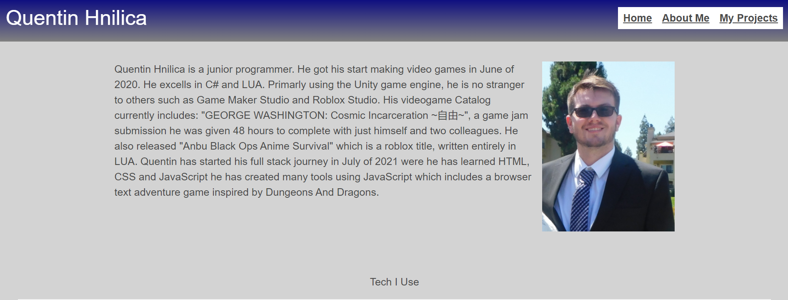

# my-portfolio

## How to use
1. Open this link: [Github Pages Link](https://quentinhnilica.github.io/my-portfolio/)
2. Click any buttons for your corisponding question to be taken to the answer
3. Using the Nav bar you can flip between pages
4. On the projects page, clicking the images will take you to the projects website

## Design 
- Used Bulma for styling the page.

## Features
- All of my information
- Full responsive UI

## Languages Used
- JavaScript (Logic)
- HTML (Bones of site)
- Bulma (Styling)
- Css (For minor Tweeks)
